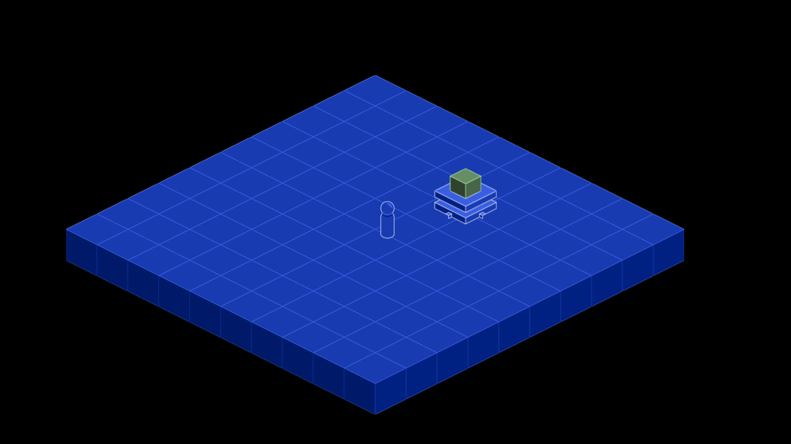
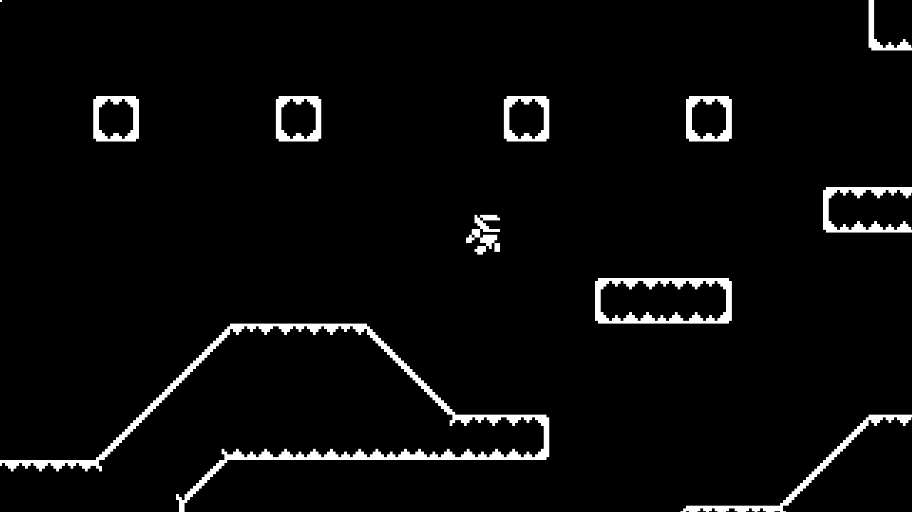
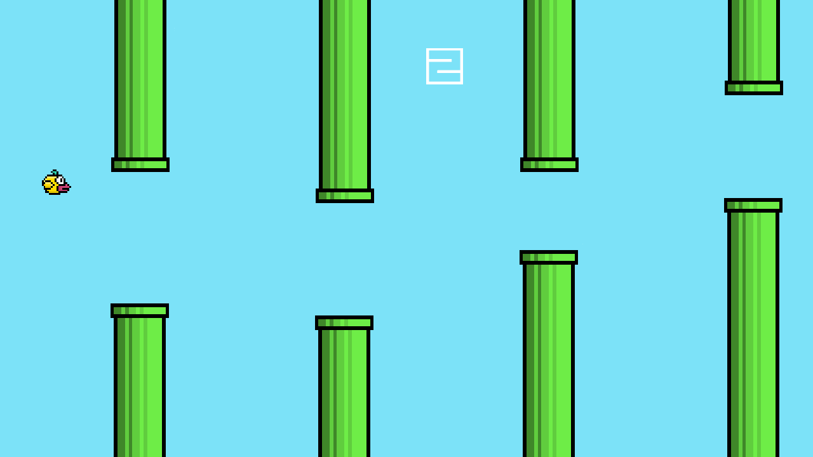
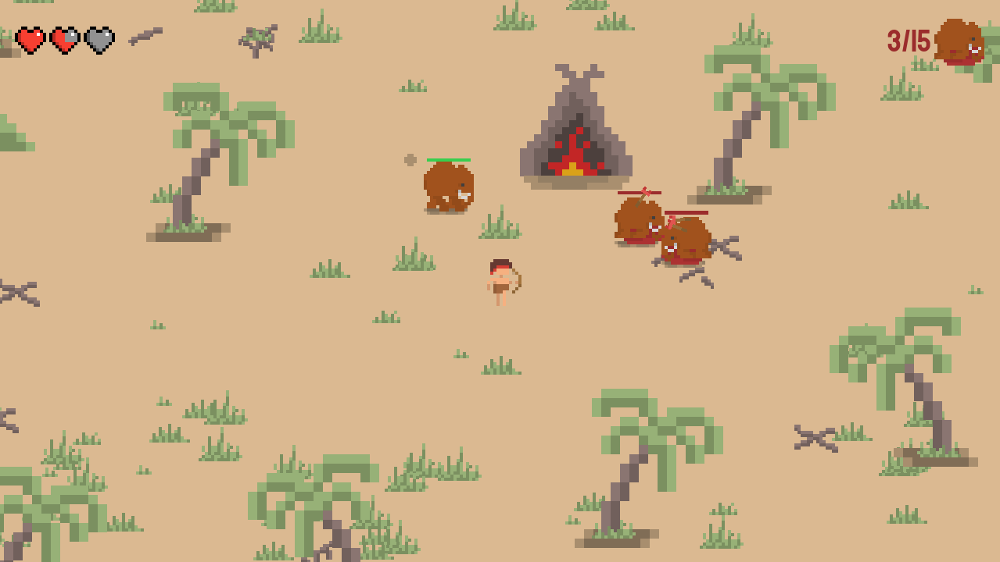
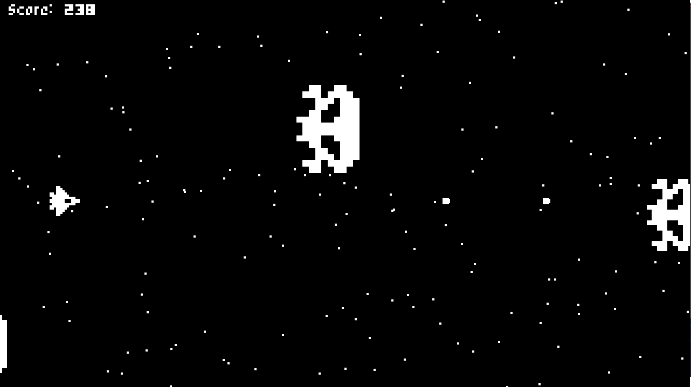
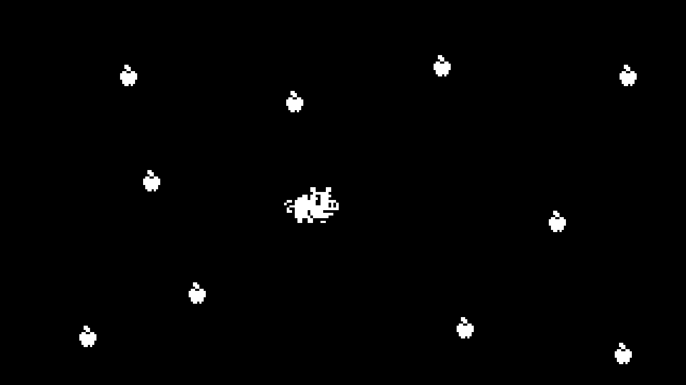
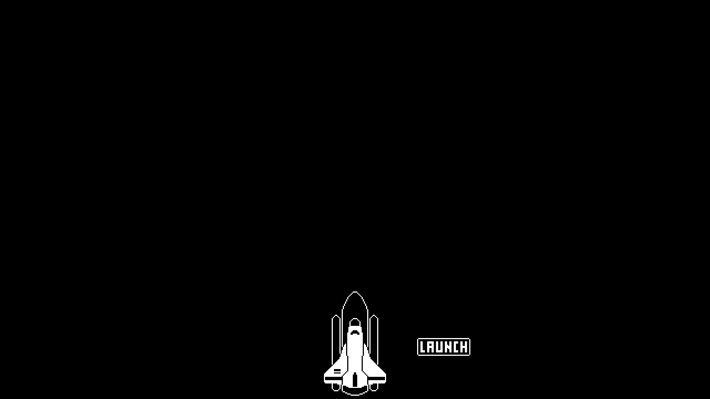

    

# Godot Games 🎮 
  

**This repository contains games and prototypes that I developed using the open source game engine [Godot](https://godotengine.org/).**  
**➡️ Play my latest game in the browser [here](https://leovct.github.io/godot-games/) :)**
  

## Table of contents
<detail>

[**🔧 Simulation Game**](#-simulation-game)  
[**👨🏼‍🚀 Metroidvania**](#-metroidvania)  
[**🐦 Flappy Bird**](#-flappy-bird)  
[**⚔️ Godot Wild Jam 26: Bloodbath**](#%EF%B8%8F-godot-wild-jam-26-bloodbath)  
[**🛸 Space Shooter**](#-space-shooter)  
[**🐖 Piggy**](#-piggy)  
[**🚀 Rocket Launch**](#-rocket-launch)

  

## 🔧 Simulation Game
Work in progress...

   

## 👨🏼‍🚀 Metroidvania
Work in progress...

   

## 🐦 Flappy Bird
Avoid obstacles and progress as far as you can.

   

## ⚔️ Godot Wild Jam 26: Bloodbath
The village awaits its new leader... Survive the mammoths and you'll be covered in glory!

   

## 🛸 Space Shooter
Defend your spaceship and shoot all the invaders.

   

## 🐖 Piggy
Eat all the apples as fast as possible.

   

## 🚀 Rocket Launch
Press the button to launch the rocket.

